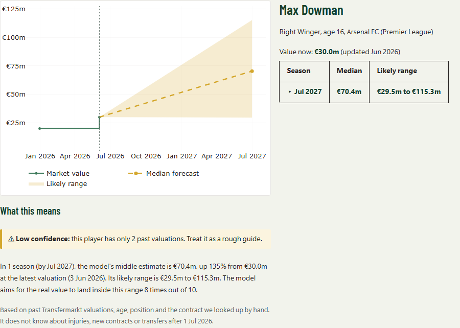
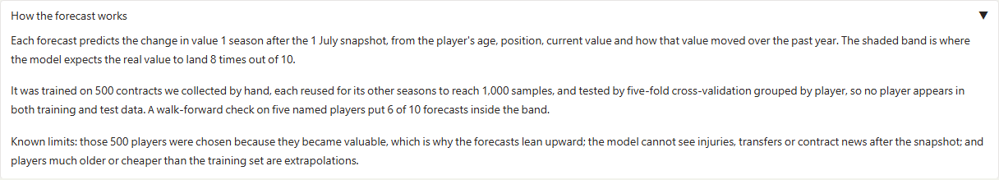

# GUI design rationale

What the interface does, which class practice each part follows, and why. Every row was
checked against `app/app.py` at commit `5baca88`; the line references are to that file.
Screenshots come from the deployed build (`lgbm-core-v1`, 4,727 players).

*First paint. The intro says what the app does, the banner states the model's upward lean,
and the most valuable player is already open so nothing starts blank.*

---

## Features and the practice behind them

| Feature | Class practice it follows | Why, and what the code actually does |
| --- | --- | --- |
| **Callback tests** | Notebook asserts, moved into pytest | `tests/test_app_callbacks.py` holds 103 tests that call the callbacks directly, with no browser. They run against a fixed mock bundle in `tests/fixtures/mock_bundle/`, pinned through `PVF_BUNDLE_DIR`, so expectations can name exact players and stay true when the shipped bundle is re-exported. |
| **Smoke test on the real bundle** | Notebook asserts, applied to live data | `tests/test_app_smoke.py` holds 22 tests that run every callback against whatever bundle sits in `app/predictions/`. It asserts shape and sanity, never a named player, so a re-export cannot break it. It caught the two real-data faults below: a column of `n/a` for horizons the model no longer has, and gaps rendering as the literal text `nan`. |
| **Actionable empty state** | Validate inside the callback, tell the user what to change | `no_match_message()` (line 261) names the live age range and lists every active filter, so the message reads "No players match. Try widening the age range (currently 15 to 45) or removing a filter: Search "zzzz"." A bare "no results" would leave the user guessing which of six filters to undo. |
| **One output list for every path** | Keep callback signatures uniform | `results` (line 760) is a single list of seven outputs. `filter_players`, `initial_view`, `on_select` and `open_example` all return exactly that shape, and `reset_filters` returns the filters plus it. Gradio needs every listener writing to the same components, and a uniform return makes a missing output a test failure rather than a silent blank panel. |
| **Leaving outputs untouched** | Clear or keep, never show stale data | `gr.skip()` marks outputs a callback should not overwrite. Changing the sort redraws the table but leaves the chart alone (line 320); a row click leaves the table, ids and count alone (line 684). Without it, every interaction would redraw the chart and the page would flicker. |
| **Keep-or-clear selection** | Clear stale outputs when the inputs change | After any filter change, `filter_players` (lines 315 to 325) checks the selected player against the whole matched set, not the visible page. Still matching, the card and explanation redraw for the chosen horizon. Filtered away, they clear to a message naming why. A click landing on a row that has since moved returns `CARD_STALE` instead of the wrong player. |
| **"What this means" panel** | Interpretation panel beside the evidence | `make_explanation()` (line 602) writes a plain-language reading under the chart: the horizon and target date, the median, the change against the latest valuation with that valuation's own date, the range, and what the range is meant to mean. The table gives the numbers; this says what to conclude from them. |
| **Deterministic template, no LLM** | Notebook 05, template beside the evidence table | The explanation is an f-string template over the same formatters the table and card use, so the words and the numbers can never disagree. `app/app.py` imports only `json`, `math`, `os`, `unicodedata`, `datetime`, `pathlib`, `gradio`, `pandas` and `plotly`: no model, no API key, no network call. |
| **Batched event wiring** | `gr.on` with `trigger_mode` and named API endpoints | One `gr.on` (line 814) binds all nine filters to `filter_players` with `trigger_mode="always_last"`, so dragging a slider runs the last value rather than queueing every intermediate one. Listeners are bound to `.input`, which fires on user edits only, so a code-set value never refilters. Five endpoints are named: `filter_players`, `initial_view`, `select_player`, `reset_filters` and `open_example`. |
| **Four rule-based examples** | Examples requirement, HAX G1-D | `EXAMPLE_RULES` (line 390) picks an established star, a rising young player, a veteran and the hardest to predict by fixed rules over the loaded bundle, so the examples stay valid when the bundle changes and no player is picked twice. `cache_examples=False` matters: Spaces would otherwise cache a result and skip the function. A hidden id column carries the exact player, since names can repeat. |
| **Labels that cannot outrun the data** | Only claim what the evidence supports | Two example labels assert a direction, so they are chosen from the picked player's own forecast: a veteran forecast to fall reads "Veteran in decline", one forecast to rise reads "Veteran: smallest predicted rise". The fall sort is renamed when a bundle contains no falls at all, and the sort helper text names the real share (currently 4%). |
| **Pinned versions** | Reproducible environment | `app/requirements.txt` pins `pandas==3.0.5`, `pyarrow==25.0.1` and `plotly==7.1.0`; the Space front matter pins `sdk_version: 6.28.0` and `python_version: "3.12"`. The app also relies on Gradio internals for the phone layout, listed in `docs/gui_notes.md`, so an unpinned upgrade could degrade it silently. |
| **Data credits on every view** | Attribution, HAX G18 | `make_footer()` (line 659) renders the Kaggle and Transfermarkt credits, the coursework notice and the bundle stamp. It sits outside every container so it is visible on every screen, not hidden in an accordion. |

## Honest-AI practices

| Feature | Class practice it follows | Why, and what the code actually does |
| --- | --- | --- |
| **Says what it does, up front** | HAX G1, make clear what the system can do | The header states the task in one sentence: pick a player, see where their value is likely heading over the next season. The wording is generated from the bundle's horizons, so it cannot drift from what the model actually forecasts. |
| **A range, not a single number** | HAX G2, make clear how well it does it | Every surface carries the 10th to 90th percentile band: a Likely range column, a shaded band on the chart, a row in the card, and a sentence in the explanation. All four say the model aims for the real value to land inside it 8 times out of 10, so the user is told the hit rate, not just the interval. |
| **Bias banner** | HAX G2, honest uncertainty about the model itself | `optimism_note()` (line 643) recomputes the share of players predicted to rise and the median multiple from the loaded bundle, and states them where the demo-data warning used to sit: currently 96% and 2.5 times. It is computed, not copied, so it cannot go stale, and it stays silent below a 60% lean, so a less biased model drops the banner by itself. |
| **Low-confidence warnings** | HAX G10, scope services when in doubt | `low_confidence_reasons()` (line 214) flags a forecast whose range is among the widest 20% at that horizon, or whose player has fewer than 3 past valuations. Flagged players carry ⚠ in the table and a blockquote in the explanation naming which rule fired. 20.6% of players are flagged on the current bundle, so the mark stays meaningful; a smoke test fails if it ever covers more than half. |
| **Opens on a real player** | HAX G10-B, a useful default instead of a blank start | `initial_view()` opens the most valuable player on first paint, so the chart, card and explanation are populated before any interaction. A first-time user sees what the app produces rather than an empty frame and a prompt. |
| **Explains each forecast** | HAX G11, make clear why the system did what it did | Beyond the numbers, the explanation names the anchor date the forecast was made from and states plainly what the model cannot see: injuries, new contracts or transfers after that date. The accordion adds how the model was trained and tested, and its three known limits. |
| **Model version and build date** | HAX G18, notify users about changes | The footer prints the model version and build date read from the bundle manifest, currently `lgbm-core-v1`, built 29 Sep 2026. A grader or teammate can tell which model produced what they are looking at without opening the repo. |

*A flagged player. The warning names the rule that fired, the explanation reads the numbers
back in plain words, and the small print states what the model cannot see.*

*The empty state names the live age range and every active filter, so the user knows what
to loosen.*

*The method and its limits are stated in the app, not only in the report. A test fails if
any of the three limits is edited out.*

---

## Where we diverged from the class approach, and why

| Divergence | Class approach | Why we went the other way |
| --- | --- | --- |
| **Precomputed bundle, no live inference** | Load the model in the app and predict on demand | The Space reads three parquet files and a manifest, never the model. Every id is indexed into a dictionary at startup, so filtering is 14 ms and opening a player is 14 ms on the free CPU. Loading LightGBM and predicting per request would add a dependency, a cold-start cost and a failure mode, for a model whose output is fixed between exports. The cost is that a new model means a re-export, which `scripts/export_bundle.py` does in one command. |
| **Plotly rather than a native Gradio plot** | `gr.LinePlot` or similar | The forecast needs a shaded band between two series, a dashed median, and a rule marking where history stops. Gradio's native plots cannot express an arbitrary filled band, so the chart is a `go.Figure` with a `fill="toself"` trace. The cost is a pinned extra dependency and hand-written theming for light and dark. |
| **Template text rather than an LLM** | Generate the explanation with a language model | The explanation is a fixed template over the same values shown in the table. It cannot hallucinate a number, costs nothing, needs no key, and is unit-testable. For a page whose whole claim is honest uncertainty, a model that might restate a forecast loosely is a liability. The cost is that the prose is repetitive across players. |
| **No player photos** | Richer cards with imagery | The app shows names, clubs and numbers only. The images on Transfermarkt are not ours to redistribute, and the data already identifies real people; adding faces would increase that exposure for no analytical gain. |
| **Horizons read from the data** | Fix the UI to the model you have | The control is built from the horizons present in the forecasts table, and hides itself when only one exists. This came out of a real failure: the model dropped from three horizons to one, and the fixed UI kept offering two options that produced a full table of `n/a`. |

## Known limits of the interface

- The phone layout targets several Gradio internal class names, listed with a recheck
  procedure in `docs/gui_notes.md`. A Gradio upgrade can degrade it with no error.
- `gr.Dataframe(pinned_columns=1)` is accepted by Gradio 6.28 but does nothing, so the
  pinned Player column on phones is a CSS workaround.
- A player with a null age would be filtered out by every age range and so be unreachable.
  No such player exists in the current bundle, and the smoke test asserts that, so it would
  be caught on the next export rather than shipped.
