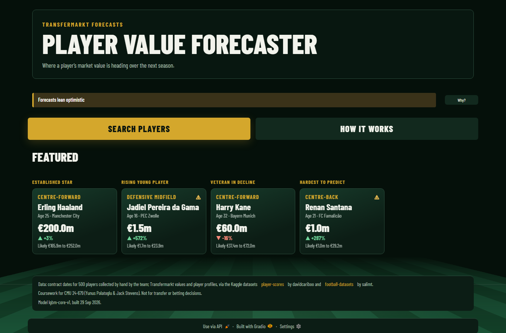
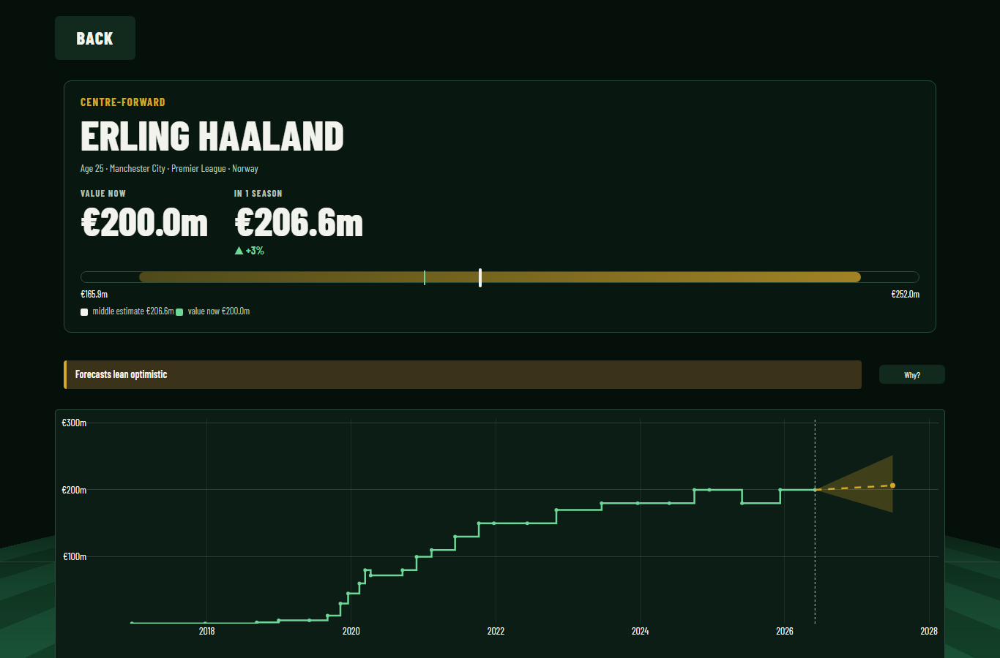
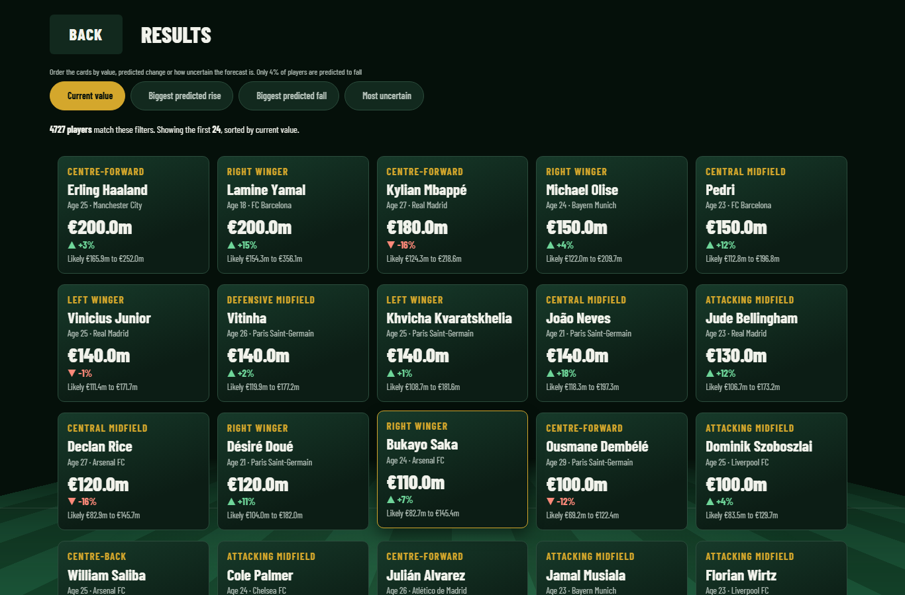
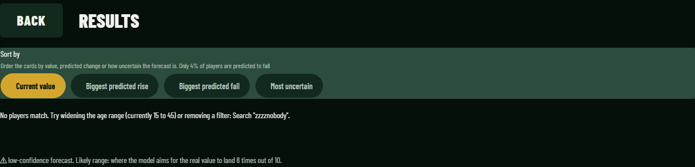

# GUI design rationale

What the interface does, which class practice each part follows, and why. Every row was
checked against `app/app.py` and `app/style.css` on the `gui/fifa` branch. Screenshots
come from the redesigned app (`lgbm-core-v1`, 4,727 players); before and after pairs for
the report are in `figures/gui/before/` and `figures/gui/after/`.

The app has four screens: Home, Search, Results and Player. Screens are `gr.Column`
blocks whose visibility is switched in a callback, so there is one page and one session.

*Home. The app says what it does, states its upward lean in one line with the full text
behind a Why button, and offers four featured players chosen by fixed rules.*

---

## Features and the practice behind them

| Feature | Class practice it follows | Why, and what the code actually does |
| --- | --- | --- |
| **Callback tests** | Notebook asserts, moved into pytest | `tests/test_app_callbacks.py` tests the pure functions and the layout, and `tests/test_app_screens.py` tests the screens and callbacks, both against the fixed mock bundle in `tests/fixtures/mock_bundle/` pinned through `PVF_BUNDLE_DIR`. That bundle carries three horizons, so it also exercises the multi horizon fallback the shipped bundle cannot reach. |
| **Smoke test on the real bundle** | Notebook asserts, applied to live data | `tests/test_app_smoke.py` runs every callback against whatever bundle sits in `app/predictions/`, asserting shape and sanity rather than named players, so a re-export cannot break it. |
| **Actionable empty state** | Validate inside the callback, tell the user what to change | `no_match_message()` names the live age range and every active filter, so the message reads "No players match. Try widening the age range (currently 15 to 45) or removing a filter: Search "zzzznobody"." |
| **One output list per path** | Keep callback signatures uniform | Navigation callbacks all return the four screen columns plus the screen name. `run_search` adds the cards, count, ids, page size and the Load more button; `open_player_screen` adds the hero, chart, three panel texts, the season table, the three panel columns, the open panel and the id. `PLAYER_OUTPUTS` is computed from `len(SCREENS)` and `len(PANELS)`, and a test asserts the success and unknown-id paths return the same shape. |
| **Leaving outputs untouched** | Clear or keep, never show stale data | `gr.skip()` marks outputs a callback must not overwrite, so opening an unknown id changes nothing on screen rather than blanking the player. |
| **Back keeps what the user had** | Clear stale outputs when inputs change, keep them when they do not | Back writes only the screen columns, so the cards, the filters and the sort chips survive it. A scroll position is saved per screen in the head script and restored on Back, which `scripts/ui_probes/back_button.py` verifies in a browser. |
| **Progressive disclosure** | Put detail behind a control, keep the decision on the face | The Player screen leads with the hero card and the chart. Explanation, confidence and raw details sit behind three buttons, one open at a time, all closed on arrival (`open_panel`). What stays on the face is the uncertainty: the likely range bar, the percent change and the ⚠ badge are never hidden, because they are what qualifies the number next to them. The same pattern carries the lean warning, which is one line with the full text behind a Why button (`lean_note_row`). |
| **Keyboard accessible cards** | Everything clickable is reachable without a mouse | Each card is a real `<button type="button" class="pvf-card" data-pid=...>` with an `aria-label` naming the player, value and change, so Tab reaches it and Enter or Space opens it. `:focus-visible` draws a gold ring. The range bar is `role="img"` with an `aria-label` stating all four numbers in words. |
| **Browser Back support** | Match the platform the app runs in | A 25 line script in `head=` pushes a history entry on every forward click and, on `popstate`, clicks a hidden button that runs the normal Back callback. Back therefore steps Player, Results, Search, Home and then leaves, which is what a browser user expects from four screens. It works inside an iframe, as on huggingface.co. Forward is not handled. |
| **Truthful labels** | Only claim what the evidence supports | Two example labels assert a direction, so they are chosen from the picked player's own forecast: `directional_label` gives "Veteran in decline" only when that player is forecast to fall, and "Veteran: smallest predicted rise" otherwise. `sort_labels` renames the fall chip when a bundle contains no falls at all, and the helper line under the chips names the real share, currently 4%. |
| **Deterministic template, no LLM** | Notebook 05, template beside the evidence table | Every sentence is an f-string over the same formatters the cards use, so words and numbers cannot disagree. `app/app.py` imports only the standard library, `gradio`, `pandas` and `plotly`: no model, no API key, no network call. |
| **Hero numbers tied to the explanation** | One source of truth per number | The hero reads the same `p50`, `current_value_eur` and `change_{h}` columns the explanation template uses. A test walks 25 players asserting the middle estimate, today's value and the percent all appear in both. |
| **Batched event wiring** | Named API endpoints | Eleven endpoints are named explicitly, the rest taking Gradio's automatic names: `run_search`, `sort_results`, `load_more`, `open_player`, `open_featured`, `clear_filters` and one per panel. Nothing auto-runs on the Search screen: filters are read when SEARCH is pressed, so a slider drag costs no requests. |
| **Paging instead of a cap** | Show a workable amount, let the user ask for more | Results draw `PAGE` (24) cards and keep the full id list in state. Load more adds another 24 and hides itself on the last page. The old table capped at 200 rows with no way past it. |
| **Pinned versions** | Reproducible environment | `app/requirements.txt` pins `pandas`, `pyarrow` and `plotly`; the Space front matter pins `sdk_version: 6.28.0` and `python_version: "3.12"`. The layout also depends on Gradio internals, listed in `docs/gui_notes.md`. |
| **Data credits on every screen** | Attribution, HAX G18 | `make_footer()` renders the Kaggle and Transfermarkt credits, the coursework notice and the bundle stamp, outside every screen so it shows on all four. A test asserts the Space README and the footer name the same datasets. |

## Honest-AI practices

| Feature | Class practice it follows | Why, and what the code actually does |
| --- | --- | --- |
| **Says what it does, up front** | HAX G1, make clear what the system can do | Home states the task in one line, generated from the bundle's horizons so it cannot drift from what the model forecasts. |
| **A range, not a single number** | HAX G2, make clear how well it does it | The range appears on every card, on the hero as a drawn bar, in the chart band and in the explanation, always with the claim that the real value should land inside it 8 times out of 10. |
| **Bias banner** | HAX G2, honest uncertainty about the model itself | `optimism_note()` recomputes the share of rising forecasts and the median multiple from the loaded bundle, currently 96% and 2.5 times. It is shown on Home and on Player, stays silent below a 60% lean, and is computed rather than copied so it cannot go stale. |
| **Low-confidence warnings** | HAX G10, scope services when in doubt | `low_confidence_reasons()` flags a forecast whose range is among the widest 20% or whose player has fewer than 3 valuations. Flagged players carry ⚠ on the card and a badge on the hero naming the rule that fired, via `flag_reason_short()`. 20.6% of players are flagged, and a smoke test fails if the mark ever covers more than half. |
| **Opens on real players** | HAX G10-B, a useful default instead of a blank start | Home shows four worked examples before any interaction, so a first visit sees what the app produces. |
| **Explains each forecast** | HAX G11, make clear why the system did what it did | "What this means" reads the numbers back in plain words and names what the model cannot see. "How sure is it" quotes the range wording, this player's flag reasons, and the evaluation and limits paragraphs lifted from the Home text verbatim. A test asserts each of those paragraphs appears, so no new claim can be added quietly. |
| **Model version and build date** | HAX G18, notify users about changes | The footer prints the model version and build date from the manifest, currently `lgbm-core-v1`, built 29 Sep 2026. |

*The Player screen. The two big numbers and the range bar stay on the face; explanation,
confidence and raw details sit behind buttons, one open at a time.*

*Results. Each card is a button carrying the value, the predicted change and the likely
range, and the helper line under the chips says only 4% of players are predicted to fall.*

*The empty state names the live age range and every active filter, so the user knows what
to loosen.*

---

## Where we diverged from the class approach, and why

| Divergence | Class approach | Why we went the other way |
| --- | --- | --- |
| **Custom HTML cards driven by `trigger()`** | Use Gradio's built-in components for anything clickable | A player card needs six fields, an arrow, a colour and a warning mark in one tap target. `gr.Dataset` and `gr.Radio` can be restyled into a grid but carry only plain text, and `@gr.render` rebuilds 24 components and their listeners on every search. We build the grid as one `gr.HTML` string and attach a single delegated listener in `js_on_load` that calls `trigger('click', {pid})`, so the Python side receives the exact id. Measured on the free CPU in the spike: 159 ms to draw 24 cards against 319 ms for `gr.render`. The cost is that we escape every bundle string ourselves, which two tests check. |
| **A history script in `head=`** | Accept that a single page app has no browser history | Four screens in one page means the browser Back button leaves the app, which users read as losing their work. The script pushes a history entry on forward clicks and routes `popstate` back into the normal Back callback. The cost is about 25 lines of hand-written JavaScript that pytest cannot reach, so `back_button.py` covers it in a real browser instead, including inside an iframe. |
| **Precomputed bundle, no live inference** | Load the model in the app and predict on demand | The Space reads three parquet files and a manifest, never the model, and indexes every id at startup. Filtering is 14 ms and opening a player 14 ms on the free CPU. Loading LightGBM per request would add a dependency, a cold start and a failure mode for output that is fixed between exports. |
| **Plotly rather than a native Gradio plot** | `gr.LinePlot` or similar | The chart needs a shaded band between two series, a dashed median and a rule where history stops. Gradio's native plots cannot express an arbitrary filled band, so the chart is a `go.Figure` with a `fill="toself"` trace, themed by hand for the dark page. |
| **Template text rather than an LLM** | Generate the explanation with a language model | The explanation is a fixed template over the values already on screen. It cannot hallucinate a number, costs nothing and is unit-testable. For a page whose whole claim is honest uncertainty, a model that might restate a forecast loosely is a liability. |
| **A CSS pitch rather than an image** | Ship a background image | The pitch is drawn with gradients on `body::before`: mowed stripes, a halfway line, a centre circle and a penalty box, under a perspective transform and a fade mask. No image file means nothing to load, no licence question and no blurring at any width. It is fixed behind the content at `z-index: -2`, and every panel over it is opaque, so contrast never depends on the backdrop. |
| **No player photos** | Richer cards with imagery | The app shows names, clubs and numbers only. Transfermarkt's images are not ours to redistribute, and the data already identifies real people. |
| **Horizons read from the data** | Fix the UI to the model you have | Controls are built from the horizons present in the forecasts table. With one horizon the Look ahead control hides and the per season table is not drawn; with three both return with no code change, which a three horizon fixture tests. |

## Known limits of the interface

- The layout targets several Gradio internal class names for the chip row, the phone
  layout and the loading indicator. A Gradio upgrade can degrade these with no error;
  `docs/gui_notes.md` lists them with a recheck procedure.
- The browser Back script handles Back but not Forward, so pressing Forward does not
  return into the app.
- The card grid is one HTML string, so a very large result set would mean a large string.
  Paging at 24 keeps it small in practice, and the full id list stays in state rather than
  in the markup.
- A player with a null age would be filtered out by every age range and so be unreachable.
  No such player exists in the current bundle, and the smoke test asserts that.
- The pitch is checked for contrast at four window heights, since a fixed backdrop sits
  differently as the window grows. Adding a screen or moving text off a panel needs that
  check rerunning: `contrast.py --sizes 1366x700,1366x1200`.
